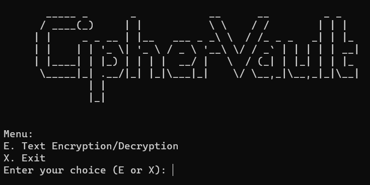

# Cipher Vault

## Classic Ciphers for Text Encryption and Decryption

Cipher Vault is a Python project that allows you to explore and apply classic ciphers for text encryption and decryption. Whether you're interested in the art of cryptography or need a tool for secure communication, Cipher Vault has you covered.



## Prerequisites

To run this project, you need to have the following installed:

- Python 3.x: [Download Python](https://www.python.org/downloads/)

## Installation

1. Clone the repository to your local machine using the following command:

    ```bash
    git clone https://github.com/Daanyal4/CipherVault.git
    ```

2. Navigate to the project directory:

    ```bash
    cd CipherVault
    ```

## Usage

1. Run the `main.py` file to start Cipher Vault:

    ```bash
    python3 main.py
    ```

2. Cipher Vault will display an introductory message.

3. You will see the following menu:

    ```
    Menu:
    E. Text Encryption/Decryption
    X. Exit
    ```

4. Enter your choice (E or X) to either explore ciphers or exit the program.

5. If you choose `E` to explore ciphers, you will be presented with a list of classic ciphers.

6. Select your desired cipher and follow the on-screen instructions to:

    - Choose an operation (encryption or decryption).
    - Provide the text to be processed.
    - Enter the required key or information.

7. Cipher Vault will perform the operation and display the result.

8. Repeat steps 5-7 to explore different ciphers and operations.

9. To exit Cipher Vault, select option `X`.

## Contribution

If you'd like to contribute to this project, please feel free to:

- Submit **pull requests**.
- Open **issues** on GitHub.

## Author

- **Daanyal Vali** (https://github.com/Daanyal4)
